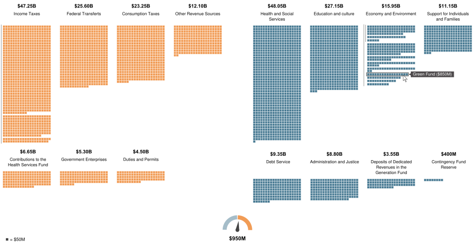

Waffster
========

Waffster is a focus-plus-context unit-based representation based on hierarchical waffle charts enabling users such as 
mass media readers to consume and explore public budget data. This visualization was done in part of my research 
project during my master's degree at Polytechnique Montreal. The code is written in 
TypeScript and uses [D3.js](https://d3js.org/) for the rendering. For more details about this project, you can take a
look at this [website](https://www.antoinebeland.com/waffster).

Waffster have several features to explore and manipulate a budget like:
- view incomes and expenditures in the same view;
- dig into budget item hierarchy;
- compare budget items;
- edit budget items by adding or deleting amounts.

A [demo](https://www.antoinebeland.com/waffster#demo) is available on the dedicated website.

Quick Start
-----------
The first step you need to do before to use Waffster is to include [D3.js v5](https://github.com/d3/d3) in your 
project.

Once you have included D3 in your dependencies, you have to include the following files in your HTML file from the 
`dist` folder:
1. The stylesheet file ([`waffster.css`](https://raw.githubusercontent.com/antoinebeland/waffster/master/dist/waffster.css));
1. The main script file ([`waffster.min.js`](https://raw.githubusercontent.com/antoinebeland/waffster/master/dist/waffster.min.js)).

To know how to use Waffster's API, you can take a look at the 
[`example`](https://github.com/antoinebeland/waffster/tree/master/example) folder.

Licence
-------
The code of this project is under GNU GPLv3 licence.
