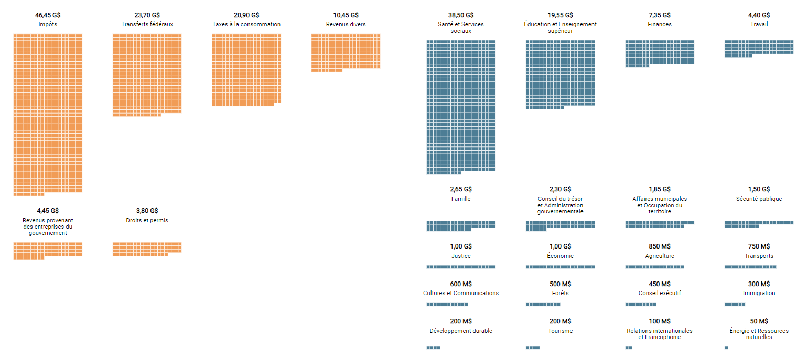

BudgetViz
=========

An interactive visualization to explore and manipulate a large budget (like government financial plans). This project
was done in part of my research project during my master's degree at Polytechnique Montreal. The code is written in 
TypeScript and uses [D3.js](https://d3js.org/) for the rendering.

The BudgetViz tool have several features to explore and manipulate a budget like:
- view income and spending elements;
- explore hierarchy of a budget;
- compare amounts between different elements;
- edit budget by adding or deleting amounts;
- get the budget state (balanced, deficit or surplus).

Getting Started
---------------
...

Usage
-----
...

License
-------
The code of this project is under GNU GPLv3 license.
